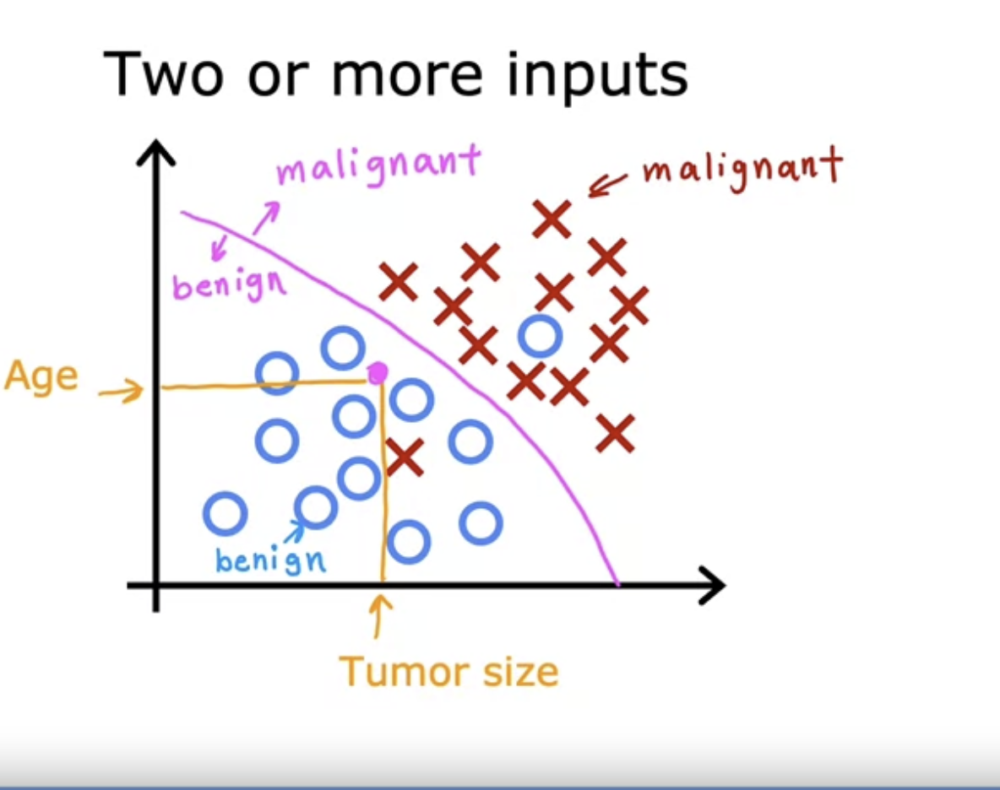

## Supervised vs. Unsupervised Machine Learning

### What is Machine Learning

- **Definition**: Field of study that gives computers the ability to learn without being explicitly programmed.
    - Arthur Samuel (trained computer to play checkers)
- The more data you give to the machine, the better it predicts.
- Two types - Supervised and unsupervised learning.
- Supervised: used most in real-world applications (course 1 and 2 focus on this).
- Unsupervised - course 3.

### Supervised Learning 

- Algorithm that learns x->y or input to output mappings.
- Learns from being given "right answers".
- Give computer examples which includes the "right answers" also called labels, and the machine learns from it.
- Subsequently, given an unlabeled data, it's able to predict the label.
- Examples (Applications):
    - Spam filtering: Input - email : Output - spam? (0/1)
    - Speech recognition: Input - audio : Output - text transcripts
    - Machine translation: Input - English : Output - Spanish
    - Online advertising: Input - ad/user : Output - click? (0/1)
    - Self-driving car: Input - image, radar info: Output - positions of other cars
    - Visual Inspection: Input - image of phone : Output - defect? (0/1)

- **Two Major types of SL**: Regression and Classification
    - **Regression**: Predict a number from infinitely many possible outputs (Example predicting the price of a house, given a data of area vs prices)
    - **Classification**: Predict Category from a small number of possible outcomes. Example - breast cancer detection (predict the diagnosis: benign or malignant) - 0 or 1
        - Class/category terms are used to denote output.
        - Predicting cat or dog.
        - Small number of possible outcomes.
        - 

### Unsupervised Learning

- Data isn't associated with any outcome. Using the above, we're not asked about the outcome i.e., we're not being asked to predict the diagnosis (benign or malignant) but instead, we're being asked to find something interesting in the unlabeled data.
- Data only comes with input x, but not output labels y.
- Algorithm has to find structure in the data. 
- For example: clustering is one such algorithm used for unsupervised learning.
- Clustering is used in Google News: to cluster similar news together.
- Example - Clustering DNA microarray.
- Example 3 - Grouping customers in different market segments.
- Other unsupervised learning algorithms:
    - Anomaly detection
    - Dimensionality reduction: compress data using fewer numbers.

### Jupyter Notebooks
